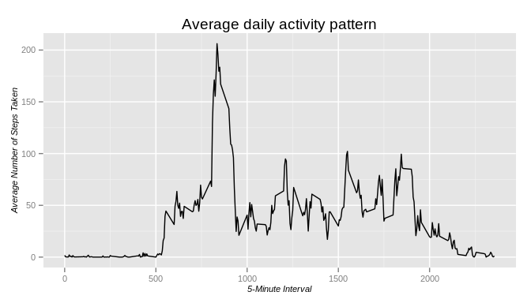

# Reproducible Research: Peer Assessment 1
Davide Madrisan  
Monday, April 14, 2015  

## Introduction

It is now possible to collect a large amount of data about personal movement
using activity monitoring devices such as a
[Fitbit](http://www.fitbit.com/),
[Nike Fuelband](http://www.nike.com/us/en_us/c/nikeplus-fuelband),
or [Jawbone Up](https://jawbone.com/up).

These type of devices are part of the _quantified self_ movement -- a group of
enthusiasts who take measurements about themselves regularly to improve their
health, to find patterns in their behavior, or because they are tech geeks.

But these data remain under-utilized both because the raw data are hard to
obtain and there is a lack of statistical methods and software for processing
and interpreting the data.

This assignment makes use of data from a personal activity monitoring device.
This device collects data at 5 minute intervals through out the day.
The data consists of two months of data from an anonymous individual collected
during the months of October and November, 2012 and include the number of steps
taken in 5 minute intervals each day.

## Loading and preprocessing the data

First we download from internet the data (a compressed _csv_ file), and load
the unzipped file by ignoring the missing values in the dataset.


```r
weburl <- "https://github.com/madrisan/data-science-coursera/raw/master/ReproducibleResearch-1/activity.zip"
ziparchive <- "activity.zip"
switch(Sys.info()[[ 'sysname' ]],
    Windows = {
            setInternet2(use=TRUE)
            download.file(weburl, ziparchive, "internal") },
    { download.file(weburl, ziparchive, "curl", extra = c("-L")) }
)
archive_info <- unzip(zipfile=ziparchive, list=TRUE)
data <- read.csv(archive_info$Name)
```

## What is mean total number of steps taken per day

We can calculate and plot the total number of steps taken per day.


```r
library(ggplot2)
```


```r
tot_steps_day <- aggregate(steps ~ date, data=data, FUN=sum, na.rm=TRUE, na.action=NULL)
granularity = diff(range(tot_steps_day$steps)) / 25
ggplot(data=tot_steps_day, aes(x=tot_steps_day$steps))              +
    geom_histogram(binwidth=granularity, col="black", fill="white") +
    labs(x="Total Steps per Day", y="Count")                        +
    theme(axis.text=element_text(size=9), axis.title=element_text(size=10, face="italic"))
```

 

The mean and median of the total number of steps taken per day follow.


```r
mean(tot_steps_day$steps, na.rm=TRUE)
```

```
## [1] 9354.23
```

```r
median(tot_steps_day$steps, na.rm=TRUE)
```

```
## [1] 10395
```

## What is the average daily activity pattern

We make a time series plot of the 5-minute interval (x-axis) and the average
number of steps taken, averaged across all days (y-axis) and we plot the result.


```r
averages <- aggregate(list(steps = data$steps), by=list(interval = data$interval),
                      FUN=mean, na.rm=TRUE, na.action=NULL)
ggplot(data=averages, aes(x=interval, y=steps)) +
    geom_line()                                 +
    ggtitle("Average daily activity pattern")   +
    xlab("5-Minute Interval")                   +
    ylab("Average Number of Steps Taken")       +
    theme(axis.text=element_text(size=9), axis.title=element_text(size=10, face="italic"))
```

 

Which 5-minute interval, on average across all the days in the dataset, contains
the maximum number of steps?


```r
averages[which.max(averages$steps), ]
```

```
##     interval    steps
## 104      835 206.1698
```

## Imputing missing values

There are a number of days/intervals where there are missing values
(coded as `NA`) in the dataset.


```r
sum(!complete.cases(data))
```

```
## [1] 2304
```

The presence of missing days may introduce bias into some calculations or
summaries of the data.
We now fill in all of the missing values in the dataset by using the mean for
that 5-minute interval.


```r
fillfunc <- function(step, interval) {
    ifelse(is.na(step), averages[averages$interval == interval, ]$steps, step)
}

data_fill <- data
data_fill$steps <- mapply(fillfunc, data_fill$steps, data_fill$interval)
```

We make a histogram of the total number of steps taken each day and calculate
and report the mean and median values.


```r
tot_steps_day <- aggregate(steps ~ date, data=data_fill, FUN=sum, na.rm=TRUE, na.action=NULL)
granularity = diff(range(tot_steps_day$steps)) / 25
ggplot(data=tot_steps_day, aes(x=tot_steps_day$steps))              +
    geom_histogram(binwidth=granularity, col="black", fill="white") +
    labs(x="Total Steps (with imputed missing data)", y="Count")    +
    theme(axis.text=element_text(size=9), axis.title=element_text(size=10, face="italic"))
```

 

```r
mean(tot_steps_day$steps)
```

```
## [1] 10766.19
```

```r
median(tot_steps_day$steps)
```

```
## [1] 10766.19
```

We can note the impact of imputing missing data on the estimates of the total
daily number of steps.  The resulting mean and median values are higher
because the missing data is no more treated as zero values.

## Differences in activity patterns between weekdays and weekends

We start by creating a new factor variable in the dataset with two levels
-- *weekday* and *weekend* indicating whether a given date is a weekday or
weekend day.


```r
switch(Sys.info()[[ 'sysname' ]],
    Windows = { lctime <- "English" }, { lctime <- "C" })
Sys.setlocale("LC_TIME", lctime)
```

```
## [1] "C"
```

```r
data_fill$date <- as.Date(data_fill$date, "%Y-%m-%d")
daytype <- function(day) {
    ifelse(weekdays(day, abbreviate=FALSE) %in% c("Saturday", "Sunday"), "weekend", "weekday")
}
data_fill$daytype <- mapply(daytype, data_fill$date)
```

And we end this document by plotting the two resulting datasets:


```r
averages <- aggregate(steps ~ interval + daytype, data=data_fill, FUN=mean)
ggplot(data=averages, aes(x=interval, y=steps))   +
       geom_line()                                +
       facet_grid(daytype ~ .)                    +
       ggtitle("Average daily activity patterns") +
       xlab("5-Minute Interval")                  +
       ylab("Number of Steps")                    +
       theme(axis.text=element_text(size=9), axis.title=element_text(size=10, face="italic"))
```

 
